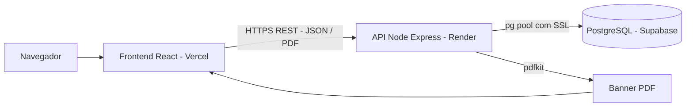
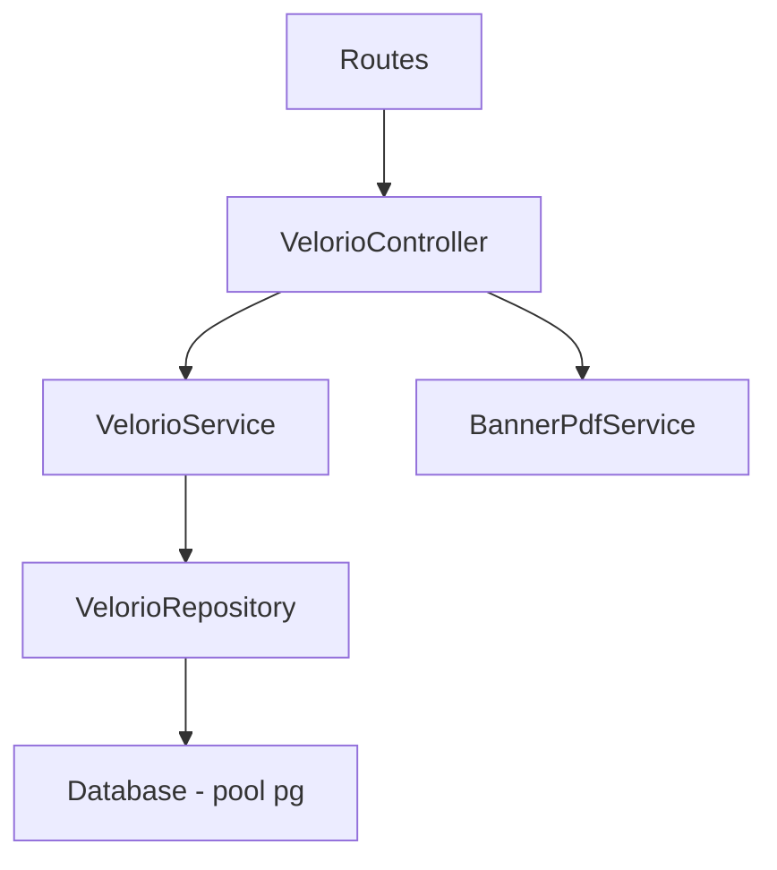
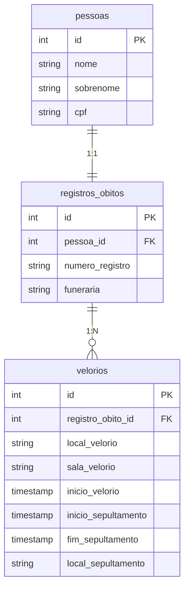

# Painel de Velórios e Sepultamentos

Este README é, ao mesmo tempo, a documentação do projeto e o registro das decisões que
eu tomei durante o desafio: o que escolhi, por que escolhi e quais alternativas
considerei e descartei. Tentei deixar explícito o raciocínio por trás de cada escolha.

## URLs de produção

- **Frontend (Vercel):** https://farewell-ygor.vercel.app
- **API Backend (Render):** https://farewell-api-661i.onrender.com

> A primeira requisição à API pode levar 50s por causa do cold start do free tier
> do Render (o serviço hiberna após inatividade). Da segunda requisição em diante fica
> imediata. Deixo isso registrado aqui de propósito, para que não seja confundido com bug.

---

## Sumário

- [Funcionalidades](#funcionalidades)
- [Stack](#stack)
- [Arquitetura](#arquitetura)
- [Modelagem de dados e consulta relacional](#modelagem-de-dados-e-consulta-relacional)
- [Regra de negócio: "em andamento"](#regra-de-negócio-em-andamento)
- [API](#api)
- [Segurança](#segurança)
- [Decisões de arquitetura (e por que eu as tomei)](#decisões-de-arquitetura-e-por-que-eu-as-tomei)
- [Testes](#testes)
- [Como rodar localmente (Docker)](#como-rodar-localmente-docker)
- [Variáveis de ambiente](#variáveis-de-ambiente)
- [Deploy em produção](#deploy-em-produção)

---

## Funcionalidades

Implementei exatamente o que o desafio pede, sem inventar requisitos que não foram
solicitados:

- **Listagem de velórios ativos** com nome completo do falecido, sala, início do velório,
  início do sepultamento, local do sepultamento e funerária responsável.
- **Agrupamento por fase do atendimento** - decidi separar a lista em "Em velório" e "Em
  sepultamento" conforme o horário do sepultamento já chegou ou não. Nenhum registro ativo é
  descartado (a união dos dois grupos é exatamente o que a API retornou); apenas fica mais
  fácil para a equipe ler, num relance, o que está em cada etapa.
- **Filtro por Registro de Óbito** no topo da tela. Optei por busca debounced (espera o
  usuário parar de digitar) e resolvida no backend, não no cliente.
- **Exportação de banner em PDF** por atendimento, contendo estritamente o que a regra
  manda: nome completo, início do velório, início do sepultamento, local do sepultamento e
  funerária. Conscientemente não incluí a sala no PDF, porque a regra do banner não a
  lista. Desenhei o banner como uma placa A4 em paisagem, com o logo institucional, pensada para ser legível à distância.
- **Atualização automática** (atualização a cada 30s) para ter o "tempo real" do painel.
- Tratei os estados de carregando, erro (com botão de retry) e vazio, porque
  um painel operacional que fica numa tela o dia inteiro precisa comunicar claramente o que
  está acontecendo.

## Stack

Segui a stack obrigatória:

| Camada   | Tecnologia                                                     |
| -------- | -------------------------------------------------------------- |
| Frontend | React 19 + Vite (JavaScript)                                   |
| Backend  | Node.js + Express (JavaScript orientado a objetos, ES Modules) |
| Banco    | PostgreSQL 15                                                  |
| PDF      | pdfkit (geração vetorial em memória, sem browser headless)     |
| Infra    | Docker + Docker Compose (local) - Render - Vercel - Supabase   |

## Arquitetura

O frontend nunca toca o banco. Construí a aplicação
inteira em torno disso: as credenciais do PostgreSQL existem apenas no backend, e toda
consulta SQL e geração de PDF acontecem na API.



No backend, decidi por uma arquitetura em camadas com responsabilidade única e injeção de
dependência, montada num composition root em
[`backend/src/server.js`](backend/src/server.js). Não usei framework de DI nem mágica: as
dependências são instanciadas e plugadas explicitamente, o que mantém o fluxo fácil de
seguir e de testar.



- **Routes** - definem os endpoints e aplicam validação (Zod) na borda.
- **Controller** - traduz HTTP em chamadas de serviço; sem regra de negócio.
- **Service** - regra de negócio e montagem dos DTOs expostos pela API.
- **Repository** - a única camada que escreve SQL; sempre com queries parametrizadas.
- **Database** - encapsula o `pg.Pool`, isolando o driver `pg` do resto do código.

Gosto dessa separação porque cada camada tem um motivo único para mudar: se amanhã eu trocar
o banco, mexo só no `Database`/`Repository`; se mudar o contrato HTTP, mexo só no
controller/rotas. As regras não vazam de uma camada para outra.

## Modelagem de dados e consulta relacional

O domínio está normalizado em três tabelas (uma pessoa tem um registro de óbito; um registro
pode ter velórios). Mantive a modelagem fiel ao `init.sql` fornecido e construí a consulta
em cima dela:



A consolidação dos dados exibidos é feita com um único JOIN. Decidi não fazer
várias idas ao banco (nem N+1): trago tudo de uma vez e já aplico o filtro opcional na mesma
query.

```sql
SELECT
  v.id,
  p.nome || ' ' || p.sobrenome AS nome_completo,
  ro.numero_registro,
  ro.funeraria,
  v.sala_velorio,
  v.local_velorio,
  v.inicio_velorio,
  v.inicio_sepultamento,
  v.local_sepultamento
FROM velorios v
JOIN registros_obitos ro ON ro.id = v.registro_obito_id
JOIN pessoas p ON p.id = ro.pessoa_id
WHERE v.local_velorio = $1
  AND v.inicio_velorio <= NOW()
  AND v.fim_sepultamento IS NULL
  AND ($2::text IS NULL OR ro.numero_registro ILIKE '%' || $2 || '%')
ORDER BY v.inicio_velorio ASC;
```

Coloquei o filtro por registro na mesma SQL, via parâmetro opcional (`$2`). Poderia ter
feito duas queries separadas (uma "lista tudo" e outra "busca por registro"), mas preferi
uma só: menos código, uma única fonte de verdade da regra e o mesmo caminho de execução com
ou sem filtro.

## Regra de negócio: "em andamento"

O desafio fala em velórios "em andamento", mas não define isso em SQL, então essa virou uma
das decisões de modelagem mais importantes do projeto.

Considero um velório **em andamento no Memorial Farewell** quando:

1. `local_velorio = 'Memorial Farewell'` - é o painel desta unidade;
2. `inicio_velorio <= NOW()` - já começou; e
3. `fim_sepultamento IS NULL` - o ciclo (velório → sepultamento) ainda não foi finalizado.

**A escolha que fiz vs. a alternativa que descartei:** adotei `fim_sepultamento IS NULL`, ou
seja, o atendimento permanece listado até o ciclo inteiro ser finalizado. Uma leitura mais
literal de "acontecendo agora" seria `NOW() < inicio_sepultamento` (o registro some assim que
o sepultamento começa). Preferi a primeira porque, na minha visão, um **painel operacional**
serve para acompanhar o atendimento até ele encerrar de fato. Não faria sentido o velório
"desaparecer" da tela da equipe no exato instante em que o sepultamento inicia. De qualquer
forma, deixei essa decisão isolada: trocar de uma interpretação para a outra é mudar **uma
linha** no `WHERE` do
[`VelorioRepository`](backend/src/repositories/VelorioRepository.js).

Também deixei `fim_velorio` de fora da regra de propósito. Existe uma janela real (velório
já encerrado, mas o sepultamento ainda não realizado) em que o atendimento **continua em
andamento**. Adicionar um check de `fim_velorio` removeria esses casos indevidamente 
`fim_sepultamento IS NULL` é o que cobre o ciclo inteiro até o atendimento de fato terminar.

> Sobre os dados de mock: como vários velórios usam `inicio_velorio = CURRENT_DATE + 'HH:MM'`
> (horários ao longo do dia, no fuso de Curitiba), a quantidade de ativos cresce conforme o
> dia avança - alguns só entram na lista depois de atingirem o próprio horário de início.
> Isso é proposital e ajuda a demonstrar a regra `inicio_velorio <= NOW()` funcionando.

## API

Base: `/api`

| Método | Rota                       | Descrição                                           |
| ------ | -------------------------- | --------------------------------------------------- |
| GET    | `/health`                  | Healthcheck (verifica conectividade com o banco).   |
| GET    | `/velorios`                | Lista velórios ativos. Query opcional `?registro=`. |
| GET    | `/velorios/:id/banner.pdf` | Gera e baixa o banner PDF do atendimento.           |

Padronizei as respostas de erro em JSON (`{ "error": "..." }`) com o status adequado: 400
para entrada inválida, 404 para recurso inexistente e 500 genérico sem vazar detalhes
internos. Mantive só GET porque o painel é de leitura, não criei endpoints de escrita.

## Segurança

Tratei segurança como requisito importante, porque a própria nota
do desafio destaca a comunicação segura entre camadas:

- **Isolamento do banco:** o frontend só fala com a API; as credenciais do PostgreSQL existem
  apenas no backend. Esse é o coração da nota de segurança.
- **SQL 100% parametrizado** (placeholders `$1`, `$2`...). Não há concatenação de input em
  SQL em lugar nenhum, o que elimina injeção de SQL por construção.
- **Validação de entrada com Zod** ([`validate.js`](backend/src/middlewares/validate.js)): o
  `id` precisa ser inteiro positivo e o `registro` tem tamanho limitado. O controller nunca
  confia em dado cru do cliente - ele lê de `req.validated`.
- **Helmet** para cabeçalhos HTTP seguros.
- **CORS restrito** a uma allowlist (`FRONTEND_ORIGIN`), aceitando apenas `GET`.
- **Rate limiting** por IP (`express-rate-limit`), com `trust proxy` ajustado para o IP real
  atrás do proxy do Render.
- **Limite de payload** JSON (10 kB) para reduzir superfície de abuso.
- **Erros sem vazamento:** o error handler central nunca devolve stack trace ao cliente;
  o detalhe fica só no log do servidor.
- **Configuração validada no boot** ([`env.js`](backend/src/config/env.js)): a API não sobe
  sem uma forma de conexão válida - `DATABASE_URL` ou as variáveis `PG*` (fail fast).
- **TLS no banco** em produção (`DB_SSL=true`). Hoje uso `rejectUnauthorized: false`
  ([`Database.js`](backend/src/db/Database.js)), ou seja, a conexão é cifrada, mas eu não
  valido o certificado do servidor. É o caminho prático no free tier do Supabase; o ideal,
  com mais tempo, seria fornecer o certificado CA para validação completa.
- **Princípio do menor privilégio:** a API só executa `SELECT`.

## Decisões de arquitetura

Cada item é uma escolha minha, com a alternativa que considerei e o motivo de eu ter ido por um caminho:

- **JavaScript orientado a objetos + Zod.** O desafio aceita JS ou TS e
  eu optei por JS para manter a base simples. Para não perder a segurança que os tipos dão,
  validei toda a entrada externa em runtime com Zod (que é onde os bugs realmente entram) e
  escrevi o código com OO de verdade: classes com campos privados (`#`), responsabilidade
  única e injeção de dependência.
- **API Node dedicada no Render, em vez de função serverless.** Um servidor Express de longa
  duração me parece mais fiel ao requisito de "API REST" e mantém o pool de conexões quente.
  O preço é o cold start do free tier, que falei lá no topo.
- **Supabase apenas como PostgreSQL gerenciado.** O Supabase oferece um SDK que conecta o
  cliente direto no banco e eu deliberadamente não usei, porque isso violaria a regra de
  o front nunca acessar o banco. Aqui o Supabase é só o Postgres, acessado via `pg`
  exclusivamente pelo backend.
- **pdfkit, em vez de Puppeteer/HTML-to-PDF.** O banner tem layout fixo, uma placa A4 em
  paisagem, com o logo institucional embutido. Preferi gerar o PDF vetorial em memória com
  pdfkit a subir um Chromium headless, que seria pesado, mais lento e frágil num free tier.
- **Polling a cada 30s, em vez de WebSockets.** Aqui é um painel que precisa
  refletir mudanças em segundos, não em milissegundos. Polling resolve isso com simplicidade
  e robustez; WebSocket traria infraestrutura extra (conexões persistentes, reconexão) sem
  ganho proporcional para este caso de uso. Se o requisito mudasse para sub-segundo,
  reavaliaria.
- **Filtro resolvido no backend, não no cliente.** Mando o `?registro=` para a API consultar
  o banco, em vez de baixar tudo e filtrar no navegador. Isso mantém a regra centralizada e
  continua funcionando mesmo que a base cresça muito.
- **Fuso horário tratado na origem.** No `init.sql` eu fixo `America/Sao_Paulo` e uso colunas
  `TIMESTAMPTZ`, e formato as datas em pt-BR no fuso de Curitiba tanto no front quanto no PDF.
  Datas e fuso são uma fonte clássica de bug silencioso, então preferi resolver isso de forma
  explícita.

## Testes

Esta parte vai além do mínimo do desafio de propósito. Na minha opinião, a melhor forma de
mostrar como eu trabalho de verdade é cobrir o sistema em várias camadas, então tratei testes
e segurança automatizada como parte do entregável, não como extra.

| Camada                      | Ferramenta                          | O que verifico                               |
| --------------------------- | ----------------------------------- | -------------------------------------------- |
| Unitário (back)             | Vitest                              | regras isoladas: DTO, filtro, PDF, validação |
| Integração (back + DB)      | Vitest + Supertest + Testcontainers | API ponta a ponta contra um Postgres real    |
| Contrato                    | Ajv + OpenAPI 3.1                   | respostas batem com o contrato documentado   |
| Unitário/Componente (front) | Vitest + Testing Library            | hooks, formatação e componentes da UI        |
| E2E                         | Playwright                          | fluxos reais no navegador                    |
| Regressão visual            | Playwright (screenshots)            | a UI não muda sem querer                     |
| Performance                 | autocannon                          | throughput alto e latência baixa             |
| SAST                        | eslint-plugin-security + npm audit  | análise estática de código e dependências    |
| DAST                        | OWASP ZAP (baseline)                | análise dinâmica da API no ar                |

```bash
cd backend && npm test
npm run lint
npm run test:perf

cd frontend && npm test
docker compose up -d
cd frontend && npm run test:e2e
```

> Nota: integração/contrato/performance usam Testcontainers (precisam de Docker);
> E2E e regressão visual exigem o stack no ar e os navegadores do Playwright
> (`npx playwright install`); o DAST baixa a imagem do OWASP ZAP. As baselines visuais são
> específicas de SO e se regeneram em outro ambiente. Rodar os testes é opcional para
> avaliar o app, ele funciona sem nada disso.

## Como rodar localmente (Docker)

Pré-requisitos: **Docker** e **Docker Compose**.

```bash
docker compose up -d --build
```

> As credenciais do banco local têm valores padrão de desenvolvimento no
> `docker-compose.yml` (via `${VAR:-default}`). Fiz assim de propósito para que `docker
> compose up` funcione sem nenhum passo manual. Para sobrescrever, basta exportar
> `POSTGRES_USER` / `POSTGRES_PASSWORD` / `POSTGRES_DB` antes de subir.

Isso sobe três contêineres:

- **db** (PostgreSQL) - executa `database/init.sql` na primeira inicialização (schema + mock).
- **backend** (API) - http://localhost:3000 (espera o banco ficar healthy antes de subir).
- **frontend** (Vite dev server) - http://localhost:5173.

Acesse **http://localhost:5173**. Para verificar a API: http://localhost:3000/api/health.

Para encerrar:

```bash
docker compose down
```

## Variáveis de ambiente

**Backend** (`backend/.env`, veja [`.env.example`](backend/.env.example)):

| Variável                                    | Exemplo                                                | Obrigatória |
| ------------------------------------------- | ------------------------------------------------------ | ----------- |
| `NODE_ENV`                                  | `development` / `production`                           | não         |
| `PORT`                                      | `3000`                                                 | não         |
| `DATABASE_URL`                              | `postgres://<usuario>:<senha>@host:5432/luto_curitiba` | condicional |
| `PGHOST`/`PGUSER`/`PGPASSWORD`/`PGDATABASE` | `db` / `admin` / ...                                   | condicional |
| `DB_SSL`                                    | `false` (local) / `true` (Supabase)                    | não         |
| `FRONTEND_ORIGIN`                           | `http://localhost:5173`                                | não         |

> Sobre a conexão: aceito `DATABASE_URL` (que uso em produção/Supabase) ou as
> variáveis padrão `PG*` (que é como o `docker compose` configura o local). A API valida
> no boot que ao menos uma das duas formas existe, escolhi falhar rápido em vez de subir
> "meio configurado".

**Frontend** (`frontend/.env`, veja [`.env.example`](frontend/.env.example)):

| Variável       | Exemplo                 | Obrigatória         |
| -------------- | ----------------------- | ------------------- |
| `VITE_API_URL` | `http://localhost:3000` | não (default local) |

## Deploy em produção

Segui as plataformas sugeridas no desafio: Supabase para o banco, Render para a API e Vercel para o front.

### 1. Banco - Supabase

1. Criar um projeto no Supabase.
2. No **SQL Editor**, colar e executar o conteúdo de [`database/init.sql`](database/init.sql)
   (cria as tabelas e insere os dados).
3. Em **Project Settings → Database**, copiar a _connection string_ no modo **Session/Pooler**
   (ela fornece IPv4, que o Render precisa).

### 2. API - Render

1. **New → Blueprint** apontando para este repositório (usa o [`render.yaml`](render.yaml)),
   ou criar um **Web Service** manual com _root directory_ `backend`, build `npm install`,
   start `npm start`.
2. Configurar: `DATABASE_URL` (do Supabase), `DB_SSL=true`, `FRONTEND_ORIGIN` (a URL do
   Vercel) e `NODE_ENV=production`.
3. _Health check path_: `/api/health`.

### 3. Frontend - Vercel

1. **New Project** importando este repositório com _root directory_ `frontend` (o Vite é
   detectado automaticamente; veja [`vercel.json`](frontend/vercel.json)).
2. Definir `VITE_API_URL` com a URL pública da API no Render.
3. Depois do deploy, atualizar `FRONTEND_ORIGIN` no Render com a URL final do Vercel e
   preencher os links no topo deste README.
